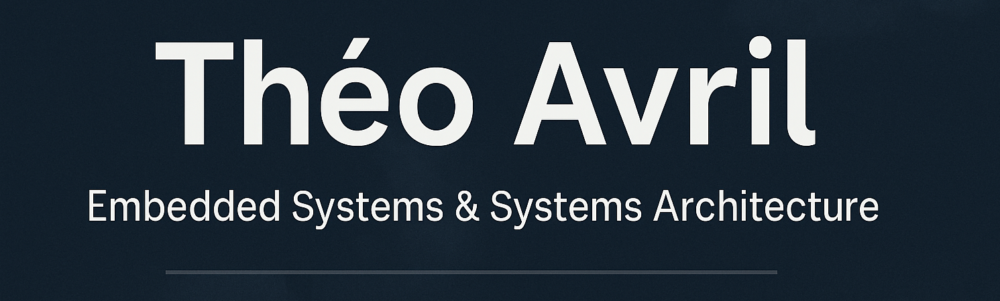

# Théo Avril — Embedded Systems Engineer & Future Systems Architect

  

<h1 align="center">Hi, I’m Théo 👋</h1>

  <b>Embedded Systems Engineer · Future Systems Architect · FPGA & Secure Comms Enthusiast</b>

  
  
  
  

## 🧑‍💻 About Me

Embedded Systems Engineer · Future Systems Architect

Final-year engineering student specializing in Embedded Systems (C/C++, Linux, RTOS, secure communication).  
I build end-to-end systems — from low-level firmware to Android apps, DevOps tooling, and self-hosted infrastructure.

🎯 Currently: FPGA Engineering Intern @ThalesGroup Belgium  
🎓 ESEO — Embedded Systems major

## 🛠 Tech Stack

(C, C++, RTOS, Protobuf, TLS/OpenSSL, Android/Java, Linux, Docker, Proxmox, Git, PostgreSQL, CI/CD...)

## 📌 Highlighted Projects

### PDS – Support Drone Prototype
TLS + Protobuf secure comms · Custom protocol · Firmware + Android

### Monopoly Zapped - Remake of the classic board game iPad app
Android/Java · Custom UI · Local multiplayer · Capacitive card reader · autosave

### Synchro – Linux Backup Tool
Rsync core · CLI UI · .deb packaging · Zenity GUI

### Portfolio Website
Astro · Tailwind CSS · GSAP · TypeScript · Docker · Nginx · i18n (JSON)

### Securite_SE
Linux · C · Bash · Pandoc · XeLaTeX · Makefile · PlantUML · Python (esptool)

### RPG RUST
Rust · Macroquad · Concurrence (Arc/Mutex, threads) · Génération procédurale · Markdown/Pandoc (documentation)

### Visual UML Editor (VUE)
Java + React · PlantUML · Tree-Sitter · Round‑trip engineering

## 📊 GitHub Analytics

https://github-readme-stats.vercel.app/api?username=theox33  
https://github-readme-stats.vercel.app/api/top-langs/?username=theox33  

## 🤝 Connect

Portfolio: https://theo-avril.fr  
Email: contact@theo-avril.fr  
